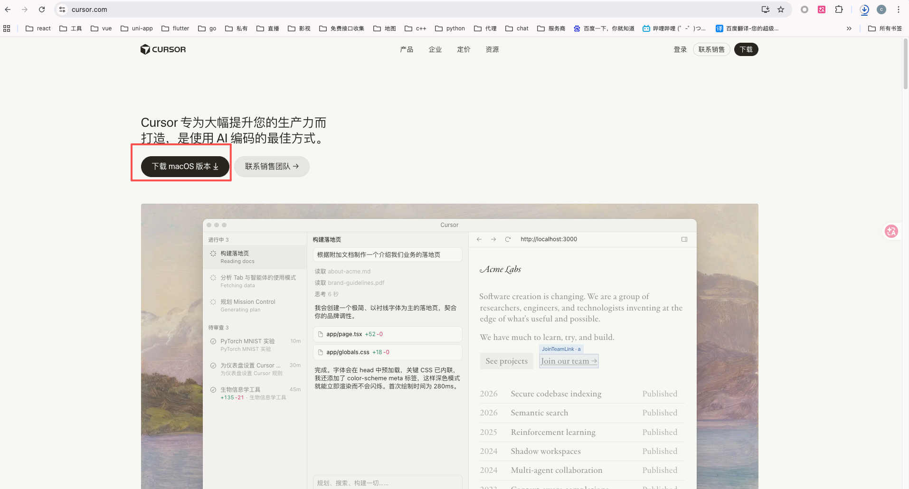
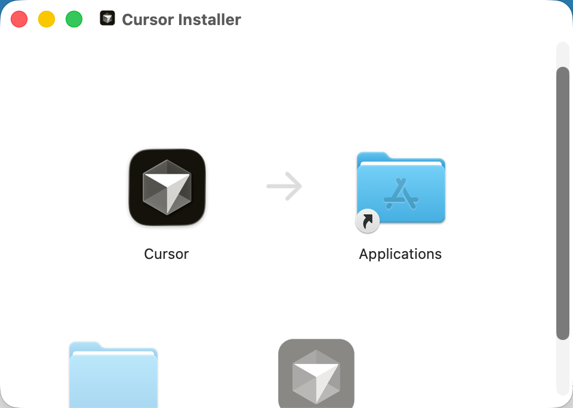
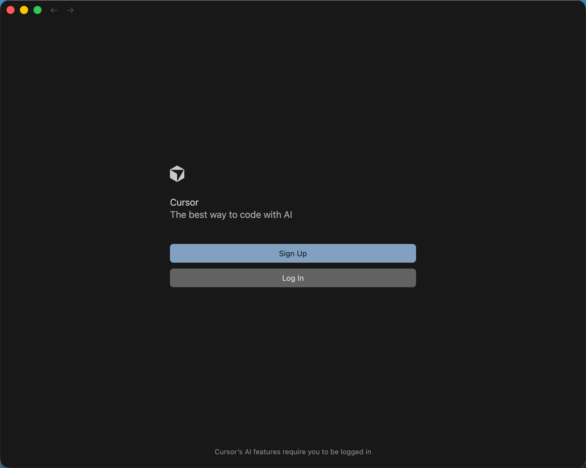
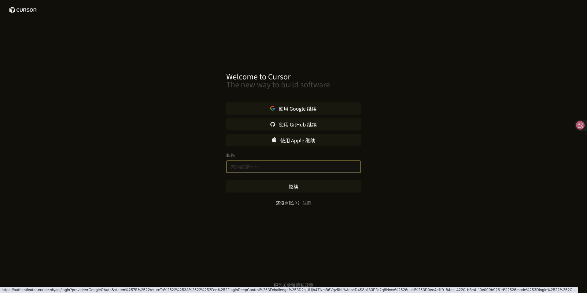
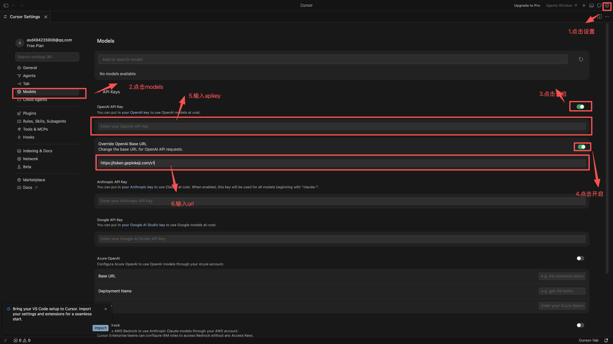
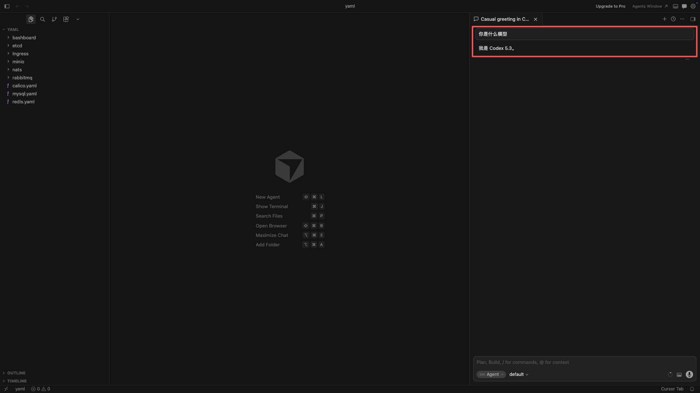

# Cursor 接入 OpenAI 兼容 API 教程 默认以会科学上网


你开始前先准备好：

- `Base URL`：这里填 `https://token.gepinkeji.com/`
- `API Key`：例如 `sk-xxxx`
- `Model`：例如 `GPT-5.4`

## 官方网站

- Cursor 官网：https://cursor.com/
- Cursor 下载页：https://cursor.com/en-US/download
- Cursor 文档：https://docs.cursor.com/

## 先看最重要的说明

Cursor 官方文档明确支持：

- 在 `Cursor Settings > Models` 中填写 API Key
- 使用 OpenAI、Anthropic、Google、Azure OpenAI、AWS Bedrock

但截至目前公开官方文档中，没有把“第三方 OpenAI 兼容网关的自定义 Base URL”单独写成一份完整说明。

所以这篇教程我会这样写：

1. 先按官方文档教你完成安装和 API Key 配置
2. 再教你在当前版本里查找 `Base URL` / `OpenAI URL` / `Override OpenAI Base URL` 这类字段
3. 如果你的版本没有这个字段，我会明确告诉你这时该怎么办

## 使用前你要知道

Cursor 官方还特别说明了两点：

1. 自定义 API Key 只适用于标准聊天模型
2. 像 Tab Completion 这类依赖 Cursor 专有模型的功能，不一定走你自己的 Key

所以你接入成功后，建议优先用聊天窗口做测试，不要先拿自动补全来判断成败。

### 第 1 步：下载 安装包 macos 为例子

到官方下载安装页下载 版本并安装：

- 下载地址：https://cursor.com/en-US/download
- 如果你是公司电脑、希望给所有用户统一安装，也可以选系统级安装包


下载完成后：

1. 吧macos 推拽到app中

2. 按默认选项继续安装
3. 安装完成后打开 Cursor
4. 登陆 



### 第 2 步：完成首次启动

第一次打开时，按提示完成这些基础设置：

1. 选择键位风格
2. 选择主题
3. 完成初始化

这一步和接口接入无关，直接按默认走也可以。

### 第 3 步：打开模型设置页


### 第 5 步：查找 Base URL 相关字段


继续在同一页找这些名字相近的字段：

- `Base URL`
- `OpenAI Base URL`
- `OpenAI URL`
- `Override OpenAI Base URL`

如果你看到了其中任意一个：

1. 把它改成你的 `Base URL`
2. 保存设置
3. 重新打开一个新聊天窗口
4. 选择一个标准聊天模型

如果你没有看到类似字段：

- 说明你当前版本公开可见的设置里，至少没有暴露出第三方 OpenAI 兼容地址入口
- 这时按官方文档，Cursor 至少能保证“自带 OpenAI API Key”接入
- 如果你必须使用第三方 OpenAI 兼容网关，建议优先改用 [OpenCode.md](./OpenCode.md) 或 [OpenClaw.md](./OpenClaw.md)

### 第 6 步：测试是否接通

新建一个聊天窗口，发送：

```text
请只回复：Cursor 已连接成功
```

如果能返回正常内容，说明聊天模型已经可用。

## 常见问题

### 1. 已经填了 API Key，但还是不走我的接口

可能原因：

- 你的版本没有开放 `Base URL` 设置
- 你测试的是专有功能，而不是普通聊天模型

### 2. 为什么 Verify 通过了，但聊天还是报错

常见原因：

- 你选了不被自定义 Key 支持的模型
- 你的兼容网关不支持 Cursor 当前发出的参数

### 3. Cursor 会不会把 Key 发到自己的服务器

根据 Cursor 官方 API Key 文档，API Key 不会被保存，但请求会经过他们的后端完成最终 prompt 组装。

## 官方参考

- [Cursor 官网](https://cursor.com/)
- [Cursor Installation](https://docs.cursor.com/get-started/installation)
- [Cursor Download](https://cursor.com/en-US/download)
- [Cursor API Keys](https://docs.cursor.com/advanced/api-keys)
