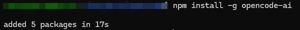
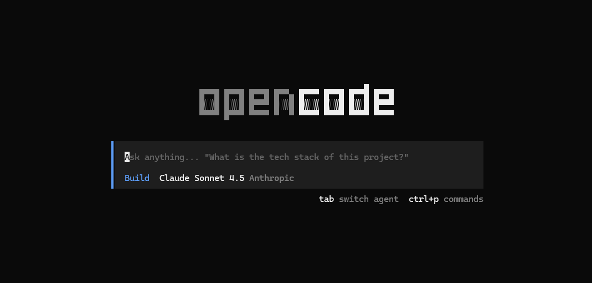
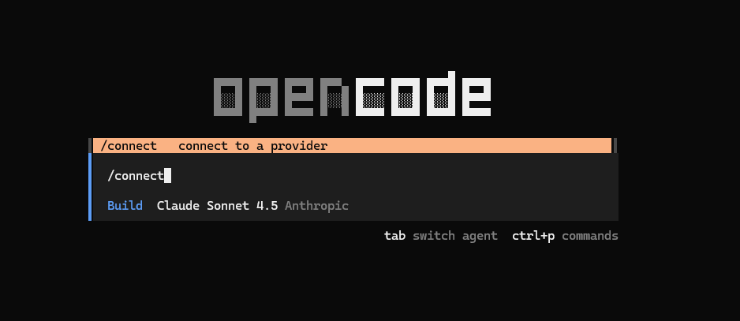
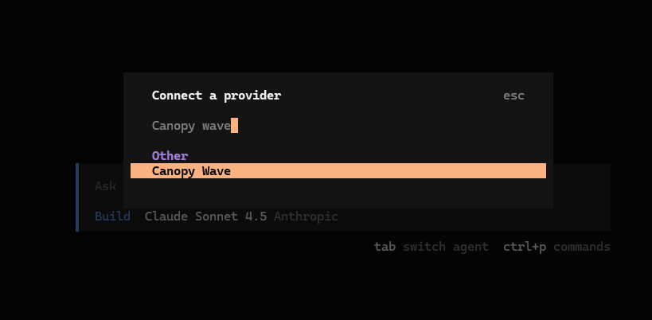
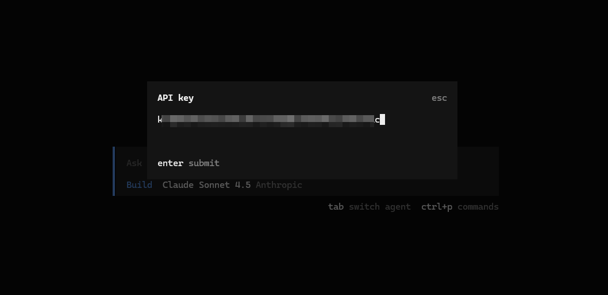
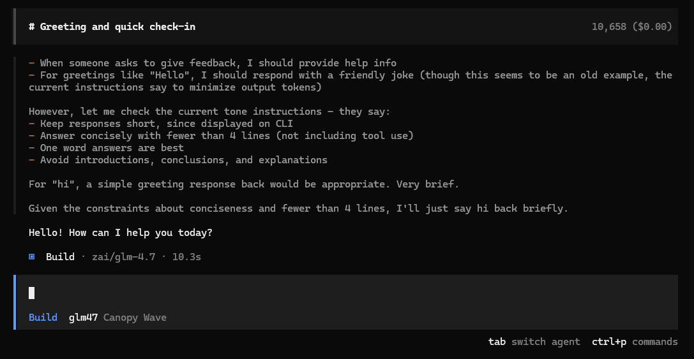

# OpenCode 接入 OpenAI 兼容 API 教程

这篇文档参考了腾讯云这篇文章的操作顺序：

- 参考文章：https://cloud.tencent.com/developer/article/2624487

但这里已经按你的实际接入信息重新整理成可直接使用的版本：

- 网关地址：`https://token.gepinkeji.com/v1`
- 示例模型：`GPT-5.4`

## 官方网站

- OpenCode 官网：https://opencode.ai/
- OpenCode 文档：https://opencode.ai/docs/
- OpenCode Providers 文档：https://opencode.ai/docs/providers
- Node.js 教程：[node.js.md](./node.js.md)

## 开始前你要准备什么

你只需要准备 3 个信息：

- `Base URL`：`https://token.gepinkeji.com/v1`
- `API Key`：你的接口密钥，例如 `sk-xxxx`
- `Model`：`GPT-5.4`

如果你还没有安装 Node.js，请先完成这里的步骤：

- [Node.js 安装教程](./node.js.md)

安装完成后，先在终端里执行：

```bash
node --version
npm --version
```

如果这两条命令都能正常返回版本号，再继续下面的 OpenCode 安装。

---

## 步骤 1：安装 OpenCode

打开终端，执行：

```bash
npm install -g opencode-ai
```

安装完成后执行：

```bash
opencode --version
```

如果能正常显示版本号，说明 OpenCode 已经装好了。



---

## 步骤 2：配置你的 OpenAI 兼容接口

### 2.1 配置文件放在哪里

你可以二选一：

1. 放在当前项目根目录，文件名叫 `opencode.json`
2. 放到全局目录：`~/.config/opencode/opencode.json`

也可以使用：

- `opencode.jsonc`

如果这些文件或目录不存在，就手动创建。

如果你是第一次接触 OpenCode，建议直接放在项目根目录，这样最不容易找错位置。

### 2.2 先理解 provider 的用法

OpenCode 可以使用：

1. 默认 provider，例如 `openai` / `anthropic` / `google`
2. 自定义 provider_id，例如你自己起一个名字

你这次给的是默认 `openai` provider 的完整配置方式，所以文档下面直接按这个结构来写。

API Key 也有两种用法：

1. 直接写进配置文件
2. 启动 OpenCode 后通过 `/connect` 命令配置

如果你只是本机自己使用，直接写进配置文件最省事。  
如果你不想把 Key 明文写进文件，就保留空配置后用 `/connect` 录入。

### 2.3 配置 `opencode.json` 或 `opencode.jsonc`

先创建配置文件，内容可以直接参考下面这份。

说明：

- 我已经把你的网关地址改成文档可直接使用的值

```json
{
  "provider": {
    "openai": {
      "options": {
        "baseURL": "https://token.gepinkeji.com/v1",
        "apiKey": "sk-请替换成你自己的真实APIKey"
      },
      "models": {
        "gpt-5-codex": {
          "name": "GPT-5 Codex",
          "limit": {
            "context": 400000,
            "output": 128000
          },
          "options": {
            "store": false
          },
          "variants": {
            "low": {},
            "medium": {},
            "high": {}
          }
        },
        "gpt-5.1-codex": {
          "name": "GPT-5.1 Codex",
          "limit": {
            "context": 400000,
            "output": 128000
          },
          "options": {
            "store": false
          },
          "variants": {
            "low": {},
            "medium": {},
            "high": {}
          }
        },
        "gpt-5.1-codex-max": {
          "name": "GPT-5.1 Codex Max",
          "limit": {
            "context": 400000,
            "output": 128000
          },
          "options": {
            "store": false
          },
          "variants": {
            "low": {},
            "medium": {},
            "high": {}
          }
        },
        "gpt-5.1-codex-mini": {
          "name": "GPT-5.1 Codex Mini",
          "limit": {
            "context": 400000,
            "output": 128000
          },
          "options": {
            "store": false
          },
          "variants": {
            "low": {},
            "medium": {},
            "high": {}
          }
        },
        "gpt-5.2": {
          "name": "GPT-5.2",
          "limit": {
            "context": 400000,
            "output": 128000
          },
          "options": {
            "store": false
          },
          "variants": {
            "low": {},
            "medium": {},
            "high": {},
            "xhigh": {}
          }
        },
        "gpt-5.4": {
          "name": "GPT-5.4",
          "limit": {
            "context": 1050000,
            "output": 128000
          },
          "options": {
            "store": false
          },
          "variants": {
            "low": {},
            "medium": {},
            "high": {},
            "xhigh": {}
          }
        },
        "gpt-5.4-mini": {
          "name": "GPT-5.4 Mini",
          "limit": {
            "context": 400000,
            "output": 128000
          },
          "options": {
            "store": false
          },
          "variants": {
            "low": {},
            "medium": {},
            "high": {},
            "xhigh": {}
          }
        },
        "gpt-5.4-nano": {
          "name": "GPT-5.4 Nano",
          "limit": {
            "context": 400000,
            "output": 128000
          },
          "options": {
            "store": false
          },
          "variants": {
            "low": {},
            "medium": {},
            "high": {},
            "xhigh": {}
          }
        },
        "gpt-5.3-codex-spark": {
          "name": "GPT-5.3 Codex Spark",
          "limit": {
            "context": 128000,
            "output": 32000
          },
          "options": {
            "store": false
          },
          "variants": {
            "low": {},
            "medium": {},
            "high": {},
            "xhigh": {}
          }
        },
        "gpt-5.3-codex": {
          "name": "GPT-5.3 Codex",
          "limit": {
            "context": 400000,
            "output": 128000
          },
          "options": {
            "store": false
          },
          "variants": {
            "low": {},
            "medium": {},
            "high": {},
            "xhigh": {}
          }
        },
        "gpt-5.2-codex": {
          "name": "GPT-5.2 Codex",
          "limit": {
            "context": 400000,
            "output": 128000
          },
          "options": {
            "store": false
          },
          "variants": {
            "low": {},
            "medium": {},
            "high": {},
            "xhigh": {}
          }
        },
        "codex-mini-latest": {
          "name": "Codex Mini",
          "limit": {
            "context": 200000,
            "output": 100000
          },
          "options": {
            "store": false
          },
          "variants": {
            "low": {},
            "medium": {},
            "high": {}
          }
        }
      }
    }
  },
  "agent": {
    "build": {
      "options": {
        "store": false
      }
    },
    "plan": {
      "options": {
        "store": false
      }
    }
  },
  "$schema": "https://opencode.ai/config.json"
}
```

你现在至少要确认这几件事：

1. `baseURL` 已经是 `https://token.gepinkeji.com/v1`
2. 你已经把 `apiKey` 替换成自己的真实密钥
3. `gpt-5.4` 已经在模型列表里
4. 这份配置使用的是默认 provider：`openai`

如果你不想把真实 Key 直接写在配置文件里，可以把 `apiKey` 那一行先删掉，保存配置后再用 `/connect` 录入。

---

## 步骤 3：开始使用 OpenCode

### 3.1 启动控制台

在项目目录里执行：

```bash
opencode
```

这时 OpenCode 会打开交互控制台。



### 3.2 如果你没有把 API Key 写进配置文件，就使用 `/connect`

在控制台里输入：

```text
/connect
```



### 3.3 输入 Provider 名称

当它让你选择或输入 Provider 时，填：

```text
openai
```



### 3.4 输入 API Key

接着把你的 API Key 粘贴进去，然后按回车。



### 3.5 开始对话

配置完成后，你就可以直接开始使用 `GPT-5.4` 了。

第一次建议先发一句最简单的话测试：

```text
请只回复：OpenCode 已连接成功
```



---

## 常见问题

### 1. 执行 `npm install -g opencode-ai` 时提示找不到 npm

这通常说明 Node.js 还没有装好。

先看：

- [Node.js 安装教程](./node.js.md)

### 2. 配置文件保存了，但还是连不上

重点检查：

- `baseURL` 是否写成了 `https://token.gepinkeji.com/v1`
- 模型名是否包含并正确填写了 `gpt-5.4`
- API Key 是否正确

### 3. `/connect` 之后还是报错

常见原因有这几种：

- 你输入的 Provider 名称不是 `openai`
- API Key 复制时多了空格
- 你的账号没有这个模型权限

### 4. 我到底该选“写进 JSON”还是“用 /connect”

建议这样选：

- 只在本机临时使用：可以直接写进 JSON，最省事
- 想让配置文件更干净：用 `/connect`

## 官方参考

- [OpenCode 官网](https://opencode.ai/)
- [OpenCode Intro](https://opencode.ai/docs/)
- [OpenCode Providers](https://opencode.ai/docs/providers)
- [OpenCode Config](https://opencode.ai/docs/config/)
- [Node.js 安装教程](./node.js.md)
