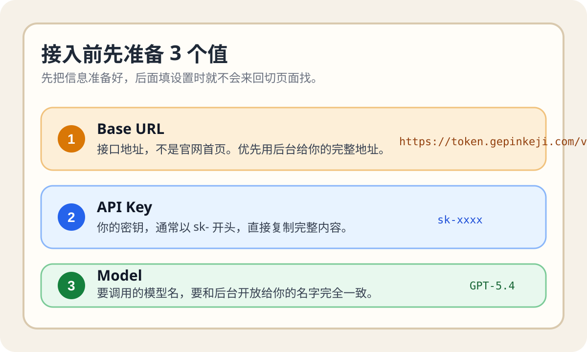
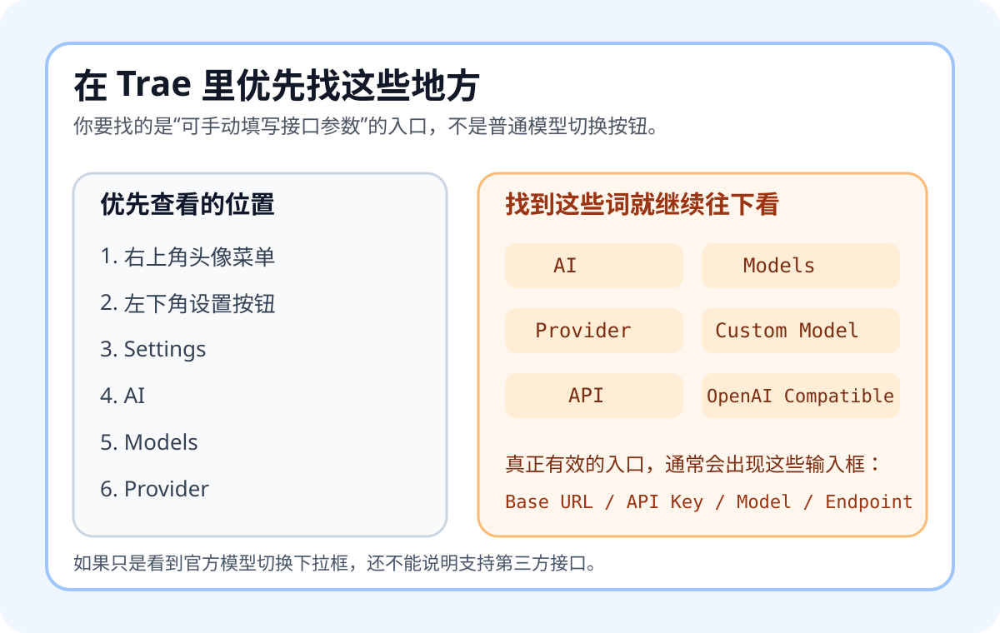
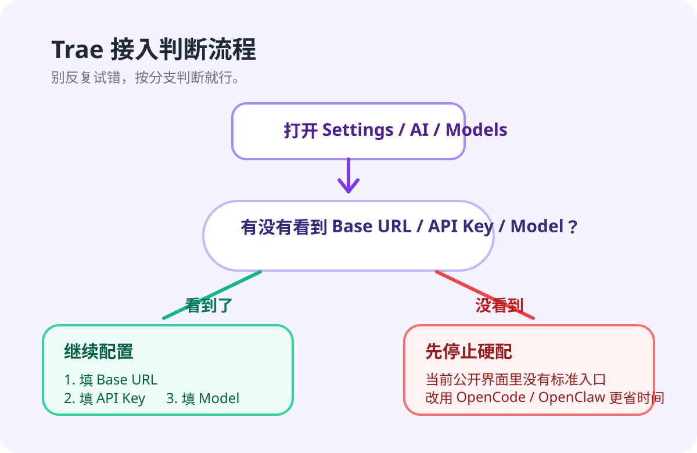

# Trae 接入我们中转站 API 教程

这篇教程是写给第一次接触接口配置的新手的。

先把最重要的话放前面：

- 截至 `2026-04-15`，Trae 官方公开文档能确认的内容主要是安装、首次启动、登录和基础 AI 设置。
- 截至 `2026-04-15`，我没有在 Trae 官方公开文档里找到一条可以稳定复现的“第三方 OpenAI 兼容 `Base URL + API Key + Model`”标准接入路径。
- 所以这篇教程不会硬编一个看起来很像真的菜单路径，而是教你怎么自己判断“当前版本能不能接”，这样最不容易白折腾。

如果你只想先看结论：

1. 先准备好 `Base URL`、`API Key`、`Model`
2. 打开 Trae，进入设置里找 `AI`、`Models`、`Provider`、`Custom Model`、`OpenAI Compatible`
3. 如果看到了自定义接口输入框，就按本文填写并测试
4. 如果根本看不到相关入口，就先停下，不要反复乱试

## 先准备好 3 个信息

你开始前，至少要准备下面这 3 个值：

| 你要填的内容 | 这是什么意思 | 示例 |
| --- | --- | --- |
| `Base URL` | 接口地址，不是官网首页地址 | `https://token.gepinkeji.com/v1` |
| `API Key` | 你的密钥，通常以 `sk-` 开头 | `sk-xxxx` |
| `Model` | 你要调用的模型名 | `GPT-5.4` |

最容易填错的是 `Base URL`。

你要记住：

- `Base URL` 填接口地址，不要填官网首页
- 如果你的后台已经给了你完整接口地址，就以后台显示为准
- 如果你拿到的是标准 OpenAI 兼容地址，通常会带 `/v1`



### 你可以直接照着填这份模板

```text
Base URL:
https://token.gepinkeji.com/v1

API Key:
sk-请替换成你自己的真实密钥

Model:
GPT-5.4
```

## 这 3 个值一般去哪里拿

如果你接的是我们自己的中转站，可以先按这条最短路径找：

1. 登录 GPAPI 控制台
2. 进入左侧菜单 `API 密钥`
3. 如果你还没有密钥，点击 `创建密钥`
4. 创建成功后，立即复制形如 `sk-xxxx` 的完整密钥
5. 还在 `API 密钥` 页面里查看或复制 `API 端点`

对新手来说，可以先这样理解：

- `API Key` 就在 `API 密钥` 页面生成
- `Base URL` 优先用 `API 密钥` 页面展示的 `API 端点`
- `Model` 不要自己猜，优先复制后台给你的准确模型名

### 如果你拿不到 `Model`，先这样确认

你可以按这个顺序确认模型名：

1. 先看中转站后台有没有 `模型列表`、`允许模型`、`可用模型`
2. 如果你拿到的是套餐说明或客服给你的模型名，直接复制原文
3. 如果只看到了展示名称，不确定真实调用名，就不要自己改写

最稳妥的做法是：

- 后台写什么模型名，你就填什么
- 不确定时，把 `GPT-5.4` 当示例，不要当成所有账号都一定可用的固定值
- 如果保存后提示模型不存在或无权限，优先怀疑模型名或分组权限，不要先怀疑 Trae

## 官方链接

- Trae 官网：https://traeide.com/
- Trae 文档：https://traeide.com/docs
- Trae 中文文档：https://traeide.com/zh/docs
- Trae 安装说明：https://traeide.com/docs/how-to-setup-trae

## 先理解这篇教程在教你什么

这篇教程不是在保证“任何版本的 Trae 都一定能接第三方接口”。

这篇教程真正帮你完成的是两件事：

1. 如果你当前版本支持自定义 OpenAI 兼容接口，你能顺着步骤把它配好
2. 如果你当前版本没有这个入口，你能很快确认“不支持”，而不是在错误的页面里反复找半天

## 第 1 步：安装并打开 Trae

### Windows

1. 进入 Trae 官网下载 Windows 版本
2. 双击安装包
3. 按默认选项安装
4. 安装完成后打开 Trae

### macOS

1. 进入 Trae 官网下载 macOS 版本
2. 打开安装包
3. 把 Trae 拖到 `Applications`
4. 第一次打开时按系统提示允许启动

### Linux

截至 `2026-04-15`，Trae 官网 FAQ 公开说明里仍以 Windows 和 macOS 为主，Linux 不属于这篇教程的稳定接入范围。

如果你必须在 Linux 上走第三方 OpenAI 兼容接口，建议优先改用：

- [OpenCode.md](./OpenCode.md)
- [OpenClaw.md](./OpenClaw.md)

## 第 2 步：完成首次启动和登录

第一次打开 Trae 时，通常会先让你完成这些基础设置：

1. 选择主题
2. 选择语言
3. 按需导入 VS Code 或 Cursor 配置
4. 登录 Trae 账号

这一段先正常完成就行，不用急着找接口设置。

如果你还没登录，建议先登录再继续，因为很多 AI 相关入口只有登录后才会显示。

## 第 3 步：去设置里找“能不能接第三方接口”的入口

这是整篇教程最关键的一步。

请你打开 Trae 后，优先按这个顺序找：

1. 右上角个人资料图标
2. `Settings`
3. 左侧导航里的 `Trae AI`
4. 再继续看有没有 `Models`、`Provider`、`Custom Model`

如果你没在上面这条路径里找到，也可以再顺手检查：

1. 左下角设置按钮
2. 设置页顶部搜索框里输入 `AI`
3. 设置页顶部搜索框里输入 `Model`
4. 设置页顶部搜索框里输入 `Provider`

如果你的设置页没有搜索框，就直接按左侧导航一项项看，不要切到系统搜索，也不用去系统文件里找。

如果你看到下面这些词，说明你已经找对方向了：

- `AI`
- `Models`
- `Provider`
- `Custom Model`
- `Custom Provider`
- `API`
- `OpenAI Compatible`
- `OpenAI-Compatible`



根据 Trae 官方当前公开的 AI 设置说明，你大概率至少会看到与 AI 聊天语言、代码索引、快捷键相关的设置。

如果公开可见的设置页里只有这些内容，却没有 `Base URL`、`API Key`、`Model` 之类的输入框，也可以把它当成一个明显信号：

`当前公开文档对应的设置页，并没有展示标准第三方 OpenAI 兼容接口入口。`

### 什么情况叫“真的找到入口了”

只有当你看到了下面这些输入框中的至少 2 到 3 个时，才算真的找到了可配置入口：

- `Base URL`
- `API Key`
- `Model`
- `Endpoint`
- `Provider`

如果你只是看到了“切换模型”或者“选择官方内置模型”的下拉框，这还不算。

## 第 4 步：如果你找到了自定义接口入口，就这样填

如果你已经看到了 `Base URL`、`API Key`、`Model` 这样的输入框，直接按下面填写：

| 字段 | 建议填写 |
| --- | --- |
| `Base URL` | `https://token.gepinkeji.com/v1` |
| `API Key` | 你的真实密钥 |
| `Model` | `GPT-5.4` |

填写顺序建议这样走：

1. 先填 `Base URL`
2. 再填 `API Key`
3. 最后填 `Model`
4. 点击保存
5. 新建一个最简单的聊天测试

### 测试话术直接复制这一句

```text
请只回复：Trae 已连接成功
```

如果你能收到正常回复，说明至少当前这组配置已经能发起请求。

如果你不确定 Trae 有没有真的保存成功，可以再做一次最简单的确认：

1. 先离开当前设置页
2. 再重新进入刚才的配置页
3. 看你填的 `Base URL`、`API Key`、`Model` 是否还在

如果这些值已经丢了，优先说明你还没有真正保存成功。

再补一个很重要的确认动作：

1. 回到 Trae 当前正在使用的 AI 或模型页面
2. 看当前选中的 Provider 或 Model，是不是你刚才保存的那一组
3. 如果页面里仍然只显示 Trae 内置模型，而没有你刚配置的自定义项，就先不要急着测

你可以把这句话记住：

`保存成功` 不等于 `当前会话已经切到你刚配置的 Provider`。

## 第 5 步：如果你没找到入口，就不要继续硬试

这一点对新手非常重要。

如果你已经认真检查过设置页，但还是没有看到 `Base URL`、`API Key`、`Model` 之类的输入框，请直接把结论定为：

`你当前看到的公开可用界面里，没有标准的第三方 OpenAI 兼容接口入口。`

这时候最稳妥的做法不是继续乱点，而是二选一：

1. 继续使用 Trae 当前内置能力
2. 改用更明确支持自定义接口的工具



更适合直接接第三方接口的替代方案：

- [OpenCode.md](./OpenCode.md)
- [OpenClaw.md](./OpenClaw.md)

## 常见错误

### 1. 把官网地址当成接口地址

错误示例：

```text
https://traeide.com/
```

这不是你的中转接口地址，不能填在 `Base URL` 里。

### 2. 把模型展示名当成真实模型名

有些后台会显示“GPT-5.4 高级版”这种展示名字，但真正要填的可能是 `GPT-5.4`。

如果填错，常见结果是：

- 保存成功但调用失败
- 提示模型不存在
- 提示没有权限

### 3. 少写了 `/v1`

如果你的接口是标准 OpenAI 兼容地址，但你只填了主域名，没有填 `/v1`，就可能请求失败。

最简单的判断方式：

- 以你后台展示的完整接口地址为准
- 如果没有单独说明，优先先试 `https://token.gepinkeji.com/v1`

### 4. 还没登录就开始找 API 设置

有些 AI 相关入口登录前不会显示。

所以正确顺序是：

1. 先安装
2. 再登录
3. 再看有没有模型或 Provider 设置

## 如果测试失败，先按这个顺序排查

### 情况 1：根本保存不了

先检查：

1. 有没有漏填必填项
2. `API Key` 是否复制完整
3. `Base URL` 是否误填成官网首页

### 情况 2：保存了，但发消息没有回复

先检查：

1. Trae 当前是不是还在使用你刚保存的 Provider
2. `Base URL` 是否应该带 `/v1`
3. 当前网络能不能访问你的接口地址

如果你用的是我们的 GPAPI 控制台，可以回到 `API 密钥` 页面做两件事：

1. 看 `API 端点` 是否和你填进 Trae 的地址一致
2. 如果页面上有 `测速`，先点一下测速，确认这个地址本身能连通

### 情况 3：提示模型不存在

先检查：

1. 模型名是不是完全照后台复制
2. 有没有把展示名称当成真实模型名
3. 当前 Key 所在分组是否允许这个模型

### 情况 4：提示无权限或鉴权失败

先检查：

1. `API Key` 是否多复制了空格
2. 这个 Key 是否已禁用、过期或没有分组
3. 这个 Key 是否有可用额度

如果你不知道去哪里看这些信息，就回到 GPAPI 控制台的 `API 密钥` 页面，重点看这一行：

- `状态`
- `分组`
- `额度`
- `今日 / 近30天用量`

如果这个 Key 没有分组，或者状态不是启用中，就算 Trae 填对了也可能调不通。

### 情况 5：你完全找不到相关设置

这时不要继续硬试，直接回到本文第 5 步，把结论定为：

`当前公开界面没有标准第三方 OpenAI 兼容接口入口。`
