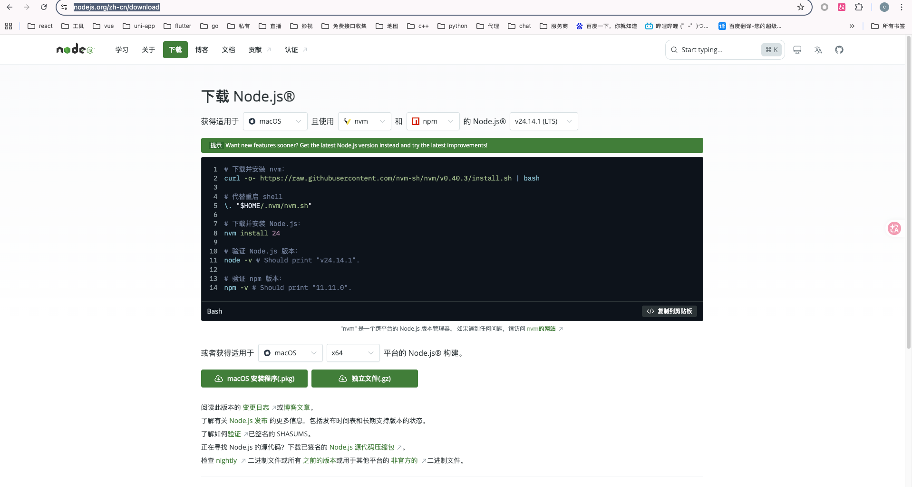
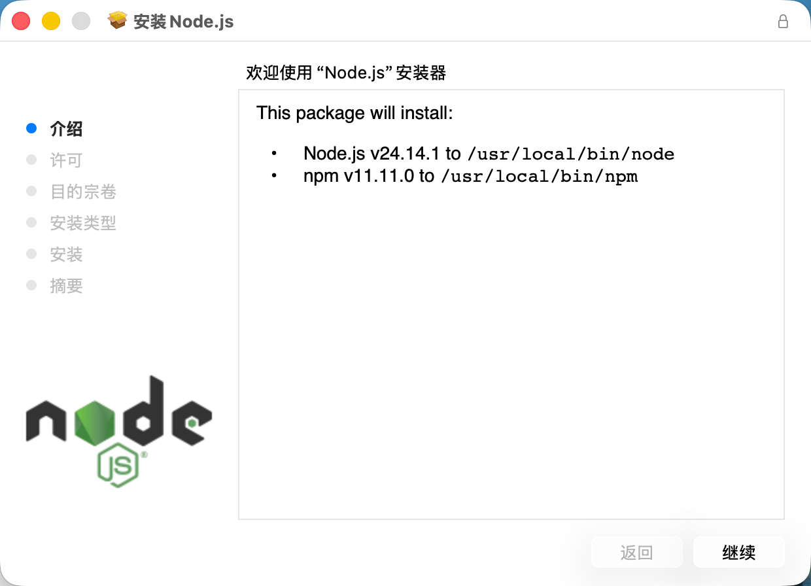
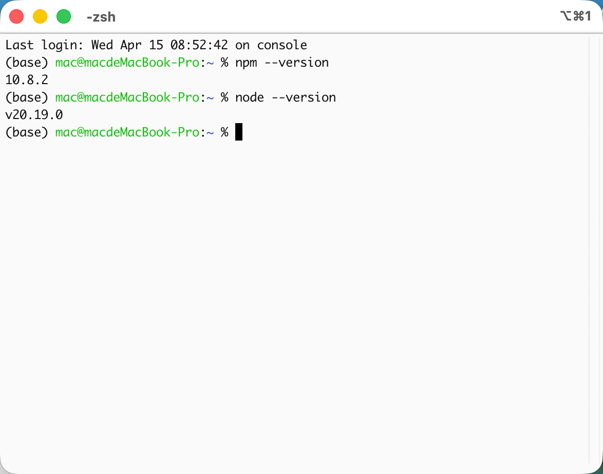
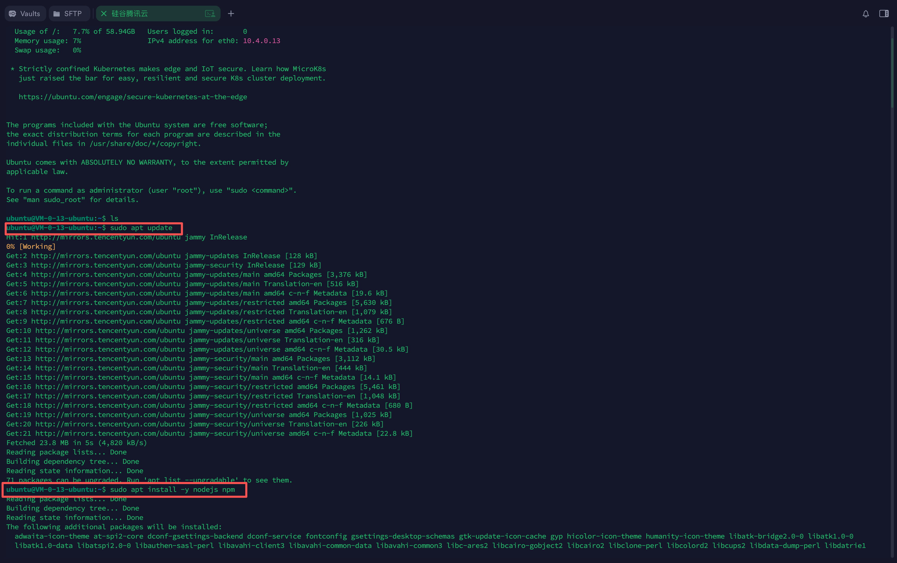
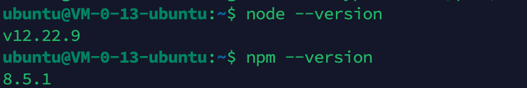

# Node.js 安装教程

这篇文档专门给第一次接触 Node.js 的同学准备。

如果你在其他接入文档里看到：

- `npm install -g ...`
- `node --version`
- `npm --version`

那就说明你需要先把 Node.js 装好，再继续后面的步骤。

## 官方网站

- Node.js 官网：https://nodejs.org/
- Node.js 下载页：https://nodejs.org/en/download
- Node.js Linux 包管理器说明：https://nodejs.org/en/download/package-manager

## 安装完成后怎么验证

无论你用什么系统，安装完成后打开终端，执行：

```bash
node --version
npm --version
```

如果都能显示版本号，说明 Node.js 已经安装成功。

建议新手优先安装 `LTS` 版本。

---

## Windows

### 第 1 步：打开下载页

进入：

```text
https://nodejs.org/zh-cn/download
```

### 第 2 步：下载 LTS 版本

建议优先下载：

- `Windows Installer (.msi)`

### 第 3 步：安装

双击安装包，然后：

1. 点击 `Next`
2. 接受协议
3. 保持默认选项
4. 点击 `Install`
5. 安装完成后关闭安装窗口

### 第 4 步：重新打开 PowerShell

把旧终端关掉，再打开一个新的 PowerShell 窗口。

### 第 5 步：验证

```bash
node --version
npm --version
```

### 常见问题

#### 1. 提示 `node 不是内部或外部命令`

先关闭终端，再打开一个新窗口重新测试。

如果还是不行，重新安装一次 Node.js，并保持默认选项。

---

## macOS

### 方式 A：官网下载包安装

这是最适合小白的方式。

#### 第 1 步：打开下载页

进入：

```text
https://nodejs.org/zh-cn/download
```

#### 第 2 步：下载 LTS 版本

如果你是：

- Apple 芯片 Mac：优先选择 Apple Silicon 对应安装包
- Intel Mac：选择 x64 安装包

#### 第 3 步：双击安装

按安装向导完成即可。
 

#### 第 4 步：验证
 - 打开终端
 
```bash
node --version
npm --version
```

### 方式 B：用 Homebrew 安装

如果你已经装了 Homebrew，也可以执行：

```bash
brew install node
```

然后执行：

```bash
node --version
npm --version
```

---

## Linux

Linux 最稳妥的办法是先看官方包管理器说明：

```text
https://nodejs.org/en/download/package-manager
```

### Ubuntu / Debian

可以先执行：

```bash
sudo apt update
sudo apt install -y nodejs npm
```


然后执行：

```bash
node --version
npm --version
```

### Arch Linux

可以执行：

```bash
sudo pacman -S nodejs npm
```

然后执行：

```bash
node --version
npm --version
```

### 常见问题

#### 1. 版本太旧

如果后续安装工具时报 Node.js 版本不够，就回到官方包管理器说明页，按官方方式升级到更高版本。

#### 2. 提示权限不足

先不要急着乱加 `sudo`，先确认 Node.js 和 npm 已经正常可用。
